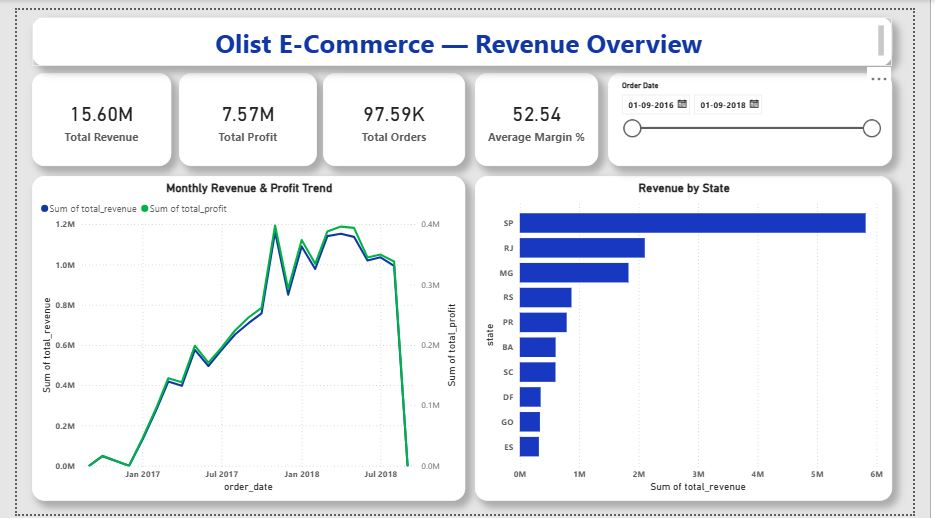
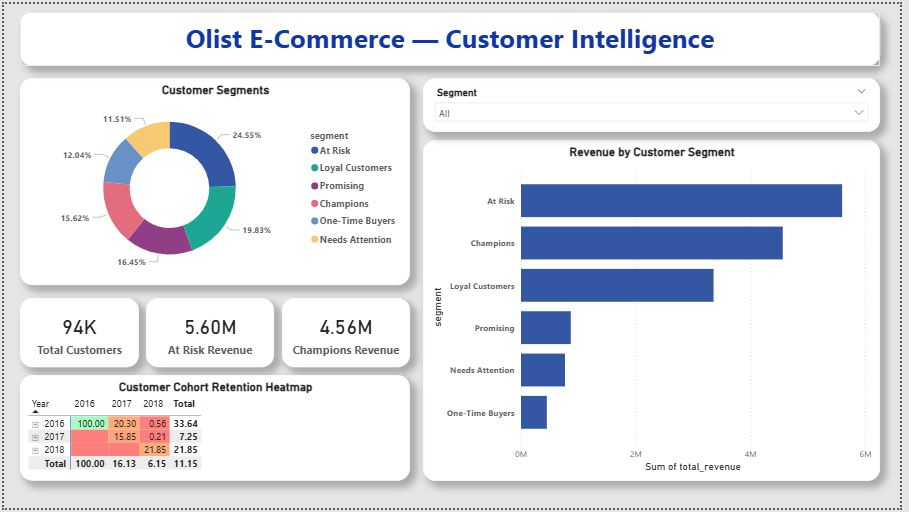
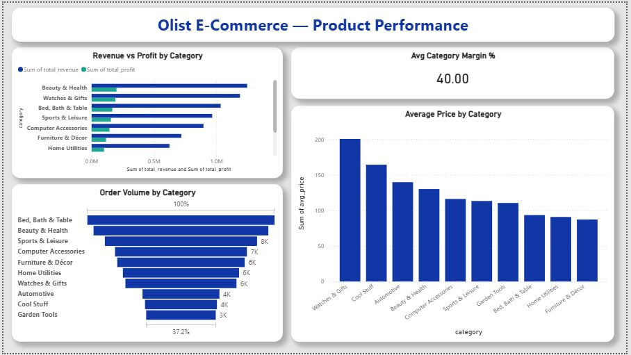
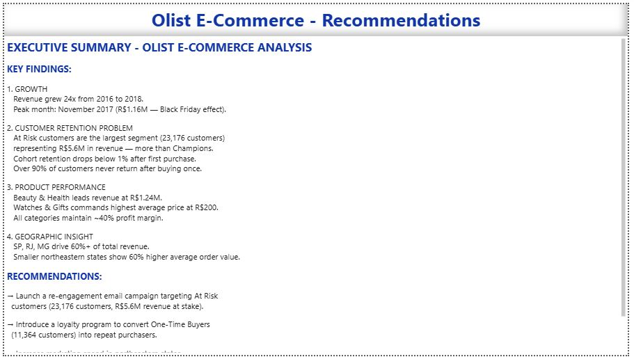

# 🛒 Olist E-Commerce — Customer Revenue Intelligence


---

## 📌 Project Overview

An end-to-end data analysis project on **97,000+ real e-commerce transactions** from Olist, Brazil's largest online marketplace. The goal was to identify why customer retention was critically low despite strong revenue growth — and deliver actionable recommendations to improve customer lifetime value.

This project covers the full data analyst workflow:
**Data Cleaning → SQL Analysis → Business Intelligence Dashboard → Strategic Recommendations**

---

## ❓ Business Problem

Olist's revenue grew **24x between 2016 and 2018**, yet profitability concerns persisted. The key question:

> *"Are we acquiring the right customers — or spending heavily to attract one-time buyers who never return?"*

---

## 🎯 Objectives

- Identify customer segments by value, recency, and purchase behaviour
- Measure repeat purchase rate and cohort retention over time
- Analyse product category performance by revenue and profit
- Deliver data-driven recommendations to improve retention and LTV

---

## 🛠️ Tools Used

| Tool | Purpose |
|---|---|
| Microsoft Excel | Data cleaning, Power Query, VLOOKUP, Pivot Tables |
| SQL (SQLite) | RFM segmentation, cohort analysis, aggregations |
| Power BI | Interactive 4-page executive dashboard |
| GitHub | Version control and portfolio presentation |

---

## 📁 Project Structure

```
olist-ecommerce-analysis/
│
├── README.md
├── olist_queries.sql              ← All 5 SQL analysis queries
├── Olist_ECommerce_Analysis.pbix  ← Power BI dashboard
│
├── sql_results/                   ← Query output tables
│   ├── monthly_revenue.xlsx
│   ├── rfm_segments.xlsx
│   ├── cohort_retention.xlsx
│   ├── category_revenue.xlsx
│   └── aov_by_state.xlsx
│
└── screenshots/                   ← Dashboard previews
    ├── page1_revenue_overview.png
    ├── page2_customer_intelligence.png
    ├── page3_product_performance.png
    └── page4_recommendations.png
```

> **Note:** Raw data sourced from [Olist Brazilian E-Commerce Dataset](https://www.kaggle.com/datasets/olistbr/brazilian-ecommerce) on Kaggle. Raw CSVs not included due to file size.

> 📥 **[Download Full Excel Analysis File](https://docs.google.com/spreadsheets/d/1Wa2NgzhxfiWK3GF5iv1GWDy5ifDf1hJO/edit?usp=drive_link&ouid=106506969989062192387&rtpof=true&sd=true)** — Cleaned master table (97,585 rows), pivot tables, and conditional formatting. Available via Google Drive.

---

## 📊 Dashboard Preview

### Page 1 — Revenue Overview


### Page 2 — Customer Intelligence


### Page 3 — Product Performance


### Page 4 — Recommendations


---

## 🔍 Key Findings

### 1. 📈 Revenue Growth
- Revenue grew **24x** from 2016 to 2018
- Peak month: **November 2017 — R$1.16M** (Black Friday effect)
- Average order value consistently around **R$140–R$150**

### 2. 🚨 Critical Retention Problem
- **Over 90% of customers never return** after their first purchase
- Cohort retention drops below **1% after month 1**
- At Risk customers are the **largest segment** with 23,176 customers

### 3. 💰 Customer Segmentation (RFM Analysis)

| Segment | Customers | Total Revenue |
|---|---|---|
| At Risk | 23,176 | R$5,595,638 |
| Champions | 14,743 | R$4,561,340 |
| Loyal Customers | 18,719 | R$3,355,482 |
| Promising | 15,530 | R$867,606 |
| Needs Attention | 10,866 | R$766,722 |
| One-Time Buyers | 11,364 | R$450,112 |

### 4. 🛍️ Product Performance
- **Beauty & Health** leads all categories at R$1.24M revenue
- **Watches & Gifts** commands highest average price at R$200
- All categories maintain ~40% profit margin

### 5. 🗺️ Geographic Insights
- **SP, RJ, MG** drive 60%+ of total revenue
- Northeastern states show **60% higher average order value** than São Paulo
- High volume ≠ high value — smaller states spend more per order

---

## 💡 Recommendations

**1. Re-engagement Campaign — At Risk Customers**
> Target 23,176 at-risk customers via email/push notifications. With R$5.6M revenue at stake, even a 10% re-engagement rate yields R$560K in recovered revenue.

**2. Loyalty Program — Convert One-Time Buyers**
> 11,364 one-time buyers represent untapped LTV. A points-based loyalty program can incentivise repeat purchases and reduce churn below 90%.

**3. Geographic Budget Reallocation**
> Northeastern states deliver 60% higher AOV. Reallocating 15–20% of acquisition spend to these regions could significantly improve revenue per customer acquired.

**4. Double Down on High-Value Categories**
> Beauty & Health and Watches & Gifts show both high revenue and premium pricing. Prioritising these categories in marketing campaigns maximises return on ad spend.

---

## ⚙️ SQL Queries

Five analysis queries are documented in `olist_queries.sql`:

1. **Monthly Revenue & Profit Trend** — MoM growth analysis with proper date formatting for Power BI
2. **RFM Segmentation** — Customer value classification using NTILE window functions and CASE segmentation
3. **Cohort Retention Analysis** — Monthly retention rates using FIRST_VALUE window function
4. **Top 10 Categories by Revenue** — Product profitability with margin % calculation
5. **Revenue & AOV by State** — Geographic spending patterns sorted by total revenue

---

## 📝 Assumptions & Limitations

- **Cost price** is not available in the Olist dataset. A simulated cost of **60% of product price** was applied to calculate profit and margin. This is a documented assumption.
- **customer_id** in Olist resets per order. **customer_unique_id** was used throughout for accurate repeat-customer analysis.
- Data covers **September 2016 to August 2018**. First and last months are incomplete and excluded from trend conclusions.
- Excel file not included in the repository due to GitHub's 25MB file size limit. Full file available via Google Drive link above.

---

## 👤 Author

**Murugesan M**
Aspiring Data Analyst | Excel · SQL · Power BI

📧 murugesanm0804@gmail.com
💼 [LinkedIn](https://www.linkedin.com/in/murugesanm8/)
🐙 [GitHub](https://github.com/MurugesanM08/)

---

*If you found this project useful, please ⭐ star the repository!*

